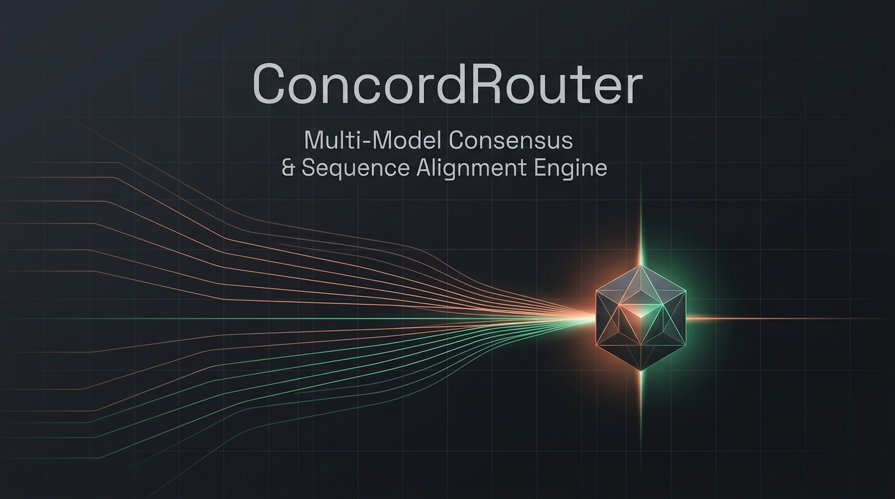

# ConcordRouter

<p align="center">
  
</p>

<p align="center">
  <strong>A Self-Hosted Multi-Model Consensus Engine & Sequence Alignment Arena</strong><br />
  Stream prompts concurrently across foundation models, align divergent prose with Needleman-Wunsch sequence algorithms, and synthesize verified drafts with statistical humanization.
</p>

<p align="center">
  <a href="https://github.com/Nilutpal-2020/concordrouter/actions"></a>
  <a href="https://golang.org"></a>
  <a href="https://nextjs.org"></a>
  <a href="https://modernc.org/sqlite"></a>
  <a href="#6-security-and-credential-isolation-byoa"></a>
  <a href="LICENSE"></a>
</p>

<p align="center">
  <a href="#quickstart">Quickstart</a> •
  <a href="#system-architecture-and-underlying-theory">Architecture & Theory</a> •
  <a href="#architectural-comparison">Comparison</a> •
  <a href="#supported-providers">Providers</a> •
  <a href="#api-reference">API Reference</a> •
  <a href="#contributing-and-community">Contributing</a>
</p>

---

## The Multi-Model Consensus Problem

Every large language model exhibits distinct systematic blindspots, alignment biases, and unannounced hallucinations. Relying exclusively on a single foundation model—whether GPT-4o, Claude 3.7 Sonnet, or Gemini 2.5 Pro—couples critical engineering decisions to arbitrary failure modes.

Traditional multi-model aggregators merely display outputs in uncoordinated text boxes. They lack the mathematical tools required to identify **where models agree, where they diverge, and how to reconcile their differences**.

**ConcordRouter** solves this by treating foundation models as an ensemble of competing contributors:
1. **Concurrent Fan-Out**: Dispatches a single prompt simultaneously across multiple LLMs via zero-blocking Goroutine pipelines.
2. **Biological Sequence Alignment for Prose**: Employs the **Needleman-Wunsch algorithm** with n-gram cosine similarity substitution scoring to pair corresponding concepts across unstructured outputs.
3. **Consensus & Divergence Heatmaps**: Computes an $M \times N$ pairwise semantic similarity matrix with cell-level inspection.
4. **Structured Cherry-Picking & AI Synthesis**: Enables hunk-by-hunk assertion assembly or model-driven consensus reconciliation.
5. **Statistical AI-Detectability Reduction**: Perturbs sentence length burstiness variance and purges tell-word clichés to align drafts with human statistical baselines—without requiring another LLM call.

---

## Architectural Comparison

| Dimension | Standard Chat UI | Multi-Bot Aggregators | ConcordRouter |
|:---|:---|:---|:---|
| **Model Scope** | Single model per thread | Multiple models, separate chats | Synchronous multi-model fan-out |
| **Streaming Engine** | Single SSE connection | Sequential or blocking streams | Concurrent non-blocking Goroutine SSE |
| **Diffing Mechanism** | None | Line-based Myers diff (`git diff`) | **Needleman-Wunsch global sequence alignment** |
| **Diff Resolution** | Word-level diff | Character/line insertions | Semantic hunk categorization (`agree`, `conflict`, `paraphrase`) |
| **Consensus Synthesis**| Manual copy-pasting | Manual prompt re-entry | In-engine cherry-pick workbench & AI synthesis |
| **Post-Processing** | None | Secondary LLM rewrite | Deterministic burstiness & perplexity perturbation |
| **Security & Privacy** | Platform telemetry | Cloud-hosted proxy logs | **100% Local / BYOA with AES-256-GCM** |

---

## System Architecture and Underlying Theory

ConcordRouter is engineered as a clean two-tier system: a high-throughput Go backend (`server/`) and an ergonomic Next.js 14 App Router frontend (`client/`).

```
[ Client Browser (Next.js 14) ]
       │
       │ HTTP / Server-Sent Events (SSE)
       ▼
[ Chi v5 HTTP Router (:8080) ]
       │
       ├─► [ Orchestrator Engine ]
       │         │
       │         ├─► Provider: Anthropic  ──(Goroutine)──► Messages API (SSE)
       │         ├─► Provider: OpenAI     ──(Goroutine)──► Chat Completions (SSE)
       │         ├─► Provider: Gemini     ──(Goroutine)──► GenerateContentStream (SSE)
       │         ├─► Provider: Ollama     ──(Goroutine)──► Local API (:11434)
       │         └─► Provider: OpenRouter ──(Goroutine)──► Gateway API (SSE)
       │
       ├─► [ Sequence Alignment Engine (internal/merge/) ]
       │         ├─► Structural Block & Sentence Segmenter
       │         ├─► 2-Gram / 3-Gram Shingle Cosine Scorer
       │         └─► Needleman-Wunsch Dynamic Programming Matrix
       │
       ├─► [ Humanization & Perturbation Engine (internal/humanize/) ]
       │         ├─► Burstiness Injection (Variance Optimization)
       │         ├─► Lexical De-Patterning (POS-Gated Tell Blocklist)
       │         ├─► Markov N-Gram Perplexity Nudging
       │         └─► Readability Targeting (Flesch-Kincaid & Gunning-Fog)
       │
       └─► [ SQLite Persistence Layer (WAL Mode, Zero-CGo) ]
```

---

### 1. Zero-Blocking Concurrency & SSE Fan-Out

When a prompt is dispatched, the orchestrator spawns independent worker Goroutines per selected model. Each worker receives a dedicated `context.WithCancel` and communicates through an unbuffered Go channel:

```go
type Provider interface {
    ID() ProviderID
    Stream(ctx context.Context, req ChatRequest) (<-chan StreamChunk, error)
}
```

- **Fault Isolation**: A stalled, rate-limited, or slow upstream provider never blocks the HTTP flusher of other providers.
- **Monotonic Event Protocol**: SSE pushes typed events (`event: init`, `event: chunk`, `event: complete`) directly to the browser.
- **Per-Pane Recovery**: If an individual provider encounters a network hiccup or upstream 502, users can retry *only that specific provider* without re-running the entire multi-model turn.

---

### 2. Needleman-Wunsch Sequence Alignment for Natural Language

Traditional diffing algorithms (such as the Myers algorithm used in `git diff`) operate on exact string matching over discrete lines or tokens. When applied to prose written by two different LLMs, Myers diff fails catastrophically: because models use different phrasing, synonyms, and word order, line-based diffs report virtually 100% divergence.

ConcordRouter adapts the **Needleman-Wunsch global sequence alignment algorithm**—originally developed for protein and DNA sequence matching—to natural language prose.

#### Dynamic Programming Matrix Formulation

Given text $A$ segmented into $M$ paragraphs/sentences $\{A_1, A_2, \dots, A_M\}$ and text $B$ segmented into $N$ paragraphs/sentences $\{B_1, B_2, \dots, B_N\}$, we compute an alignment score matrix $D \in \mathbb{R}^{(M+1) \times (N+1)}$:

$$D(i, j) = \max \begin{cases} 
D(i-1, j-1) + S(A_i, B_j) & \text{(Match / Substitution)} \\ 
D(i-1, j) + d & \text{(Deletion in } B \text{ / Unique to } A) \\ 
D(i, j-1) + d & \text{(Insertion in } B \text{ / Unique to } B) 
\end{cases}$$

Where:
- $S(A_i, B_j) \in [-1, 1]$ is the **semantic substitution score**, evaluated via cosine similarity over character and word n-gram shingle vectors.
- $d = -0.2$ is the **gap penalty**, preventing spurious alignments between conceptually unrelated assertions.

#### Traceback & Semantic Hunk Classification

Traversing backward from $D(M, N)$ to $D(0, 0)$ yields the globally optimal semantic alignment path. Each aligned hunk is classified deterministically:

- **`agree`** ($S \ge 0.82$): Both models make equivalent factual assertions.
- **`paraphrase`** ($0.55 \le S < 0.82$): Both models discuss the same topic with differing phrasing or detail.
- **`conflict`** ($0.25 \le S < 0.55$): Models address corresponding points but reach contradictory conclusions.
- **`unique_left` / `unique_right`** ($S < 0.25$ or gap step): A point introduced exclusively by one model.

---

### 3. Pairwise Cosine Similarity Heatmap Matrix

For arbitrary turns between models, ConcordRouter evaluates a complete $M \times N$ similarity matrix:

$$\text{CosineSimilarity}(\mathbf{u}, \mathbf{v}) = \frac{\mathbf{u} \cdot \mathbf{v}}{\|\mathbf{u}\| \|\mathbf{v}\|}$$

- **Shingle Representation**: Tokenizes text into unigram, bigram, and 3-gram frequencies in pure Go with sub-millisecond execution time and zero GPU requirements.
- **Visual Matrix**: Renders a smooth, color-graded heatmap in the UI (green $\to$ amber $\to$ red) with interactive cell inspection: clicking or hovering over any coordinate displays the exact cosine score and side-by-side excerpt preview.

---

### 4. Gating Heuristics & Consensus Synthesis

Reconciling text introduces user cognitive load. To maintain high developer velocity, ConcordRouter employs **Phase 4 Gating Heuristics**:
- **Length Gating**: Turns with fewer than 40 words skip alignment prompts.
- **Consensus Gating**: If overall cosine agreement exceeds $90\%$, responses are marked with a **Models in Consensus** badge.
- **Selective Activation**: The Merge Workbench activates only when outputs diverge sufficiently to require human-in-the-loop review.

When opened, the **Merge Workbench** offers three workflows:
1. **Semantic Diff**: Side-by-side aligned paragraph diff with color-coded relation tags.
2. **Chunk Picker**: Hunk-by-hunk selection (`Accept Left`, `Accept Right`, `Accept Both`) to assemble a custom merged draft.
3. **AI Synthesis**: Dispatches both responses to a chosen synthesizer model with explicit de-duplication and conflict-resolution instructions. The synthesized output is visually tagged to uphold trust boundaries.

---

### 5. Statistical AI-Detectability Reduction (The Humanizer)

AI detection systems (including GPTZero, Originality.ai, Turnitin, and DetectGPT) do not detect "AI content" through semantic understanding. They key off two mathematical signals:

$$\text{Perplexity: } PP(W) = \exp\left( -\frac{1}{N} \sum_{i=1}^N \ln P(w_i \mid w_1, \dots, w_{i-1}) \right)$$

$$\text{Burstiness: } B = \frac{\sigma - \mu}{\sigma + \mu} \quad \in [-1, 1]$$

Where:
- **Perplexity** measures next-token predictability under a reference language model.
- **Burstiness** measures the standard deviation $\sigma$ and mean $\mu$ of sentence lengths.

LLM outputs are characteristically **low-perplexity and low-burstiness**: structurally uniform, evenly paced, and statistically flat. When users prompt an LLM to "rewrite this to sound human," the model simply generates another low-burstiness output from the same probability distribution.

ConcordRouter’s post-processing stage (`/api/v1/merge/humanize`) operates **without generative LLM calls**, using deterministic statistical perturbation:
- **Burstiness Variance Injection**: Analyzes sentence length distribution $(\mu, \sigma)$. Splits monotonic, overly long compound sentences ($>30$ words) at coordinating conjunctions and merges staccato clauses ($<6$ words) with natural subordinators to elevate variance toward human baseline profiles.
- **Lexical De-Patterning**: Replaces overused AI marker clichés (*delve, tapestry, testament, landscape, pivotal, moreover, furthermore, it is important to note*, excessive em-dash chains) with natural synonyms through POS-gated dictionaries.
- **N-Gram Repetition Smoothing**: Detects repeating rhetorical scaffolding (e.g., *"not only X, but also Y"*, *"in order to ensure"*) across paragraphs and varies subsequent occurrences.
- **Readability Targeting**: Computes Flesch-Kincaid Grade Level and Gunning-Fog indices, applying natural contractions (*don't*, *can't*, *it's*) to remove textbook stiffness.
- **Post-Transform Validation**: Automatic punctuation spacing repair, casing normalization, and duplicate article removal (`the the`, `a a`).

---

### 6. Security and Credential Isolation (BYOA)

ConcordRouter adheres strictly to a **Bring Your Own Account (BYOA)** security posture:
- **Zero Token Markup**: You connect directly to official upstream API endpoints. No proxy layer, no third-party markups, no middleware latency.
- **Envelope Encryption at Rest**: Provider API credentials are encrypted with **AES-256-GCM** using unique, cryptographically random nonces.
- **Masked Previews**: Credentials never leave the local machine in plaintext; the frontend receives only masked identifiers (e.g., `sk-ant-...4x9f`).
- **Telemetry-Free**: Zero analytic beacons, zero tracking scripts, zero session recording.

---

## Supported Providers

| Provider | Authentication | Recommended Models | Implementation Details |
|:---|:---|:---|:---|
| **Anthropic** | API Key | Claude 3.7 Sonnet, Claude 3.5 Sonnet, Claude 3.5 Haiku | Official Messages API, native streaming |
| **OpenAI** | API Key | GPT-4o, GPT-4o Mini, o3-mini | Chat Completions SSE streaming |
| **Google Gemini** | API Key | Gemini 2.5 Flash, Gemini 2.5 Pro | `streamGenerateContent` API |
| **Ollama** | None (Local) | Llama 3.2, DeepSeek R1, Mistral 7B | `http://localhost:11434`, zero external network calls |
| **OpenRouter** | API Key | DeepSeek R1, Llama 3.3 70B, Qwen 2.5 | Unified meta-provider gateway |
| **Mock Arena** | None | `mock-concise`, `mock-verbose`, `mock-creative` | Built-in word-by-word streaming demo fixtures |

> **Offline Demo**: The built-in **Mock provider** generates realistic tokenized markdown streaming (including tables, code blocks, and headings) without requiring any API keys or network access.

---

## Quickstart

### Prerequisites
- [Go](https://golang.org) 1.22 or higher
- [Node.js](https://nodejs.org) 18 or higher (and `npm`)

### Option A: Local Development (Recommended)

```bash
# 1. Clone repository
git clone https://github.com/Nilutpal-2020/concordrouter.git
cd concordrouter

# 2. Start backend (:8080) and frontend (:3000) concurrently
make dev
```

Visit **`http://localhost:3000`** in your browser. The SQLite database (`concordrouter.db`) is automatically initialized with WAL mode enabled.

### Option B: Docker Compose

```bash
docker compose up -d
```

---

## Verification & Test Suite

Run the full verification suite across Go backend packages and Next.js frontend:

```bash
# Run all Go unit and integration tests
make test

# Build production binaries and client bundles
make build
```

The test suite exercises:
- Concurrent fan-out streaming and context cancellation (`internal/orchestrator`)
- Needleman-Wunsch alignment matrices and shingle similarity (`internal/merge`)
- Burstiness injection, lexical de-patterning, and n-gram perplexity (`internal/humanize`)
- AES-256-GCM encryption and masked credential preview (`internal/crypto`)
- SQLite thread and turn persistence under WAL concurrency (`internal/store`)
- All HTTP API endpoints and SSE stream flushers (`internal/api`)

---

## API Reference

The Go backend exposes a clean, self-documenting REST API on port `8080`:

| Method | Endpoint | Description | Payload Summary |
|:---|:---|:---|:---|
| `GET` | `/api/v1/health` | Service health and timestamp | — |
| `GET` | `/api/v1/providers` | List providers and active credentials | — |
| `POST` | `/api/v1/providers/keys` | Encrypt and store provider API key | `{"providerId": "openai", "apiKey": "..."}` |
| `DELETE`| `/api/v1/providers/keys/{id}` | Disconnect provider key | — |
| `GET` | `/api/v1/threads` | List all conversation threads | — |
| `POST` | `/api/v1/threads` | Create a new session thread | `{"title": "..."}` |
| `GET` | `/api/v1/threads/{id}` | Retrieve thread with message history | — |
| `DELETE`| `/api/v1/threads/{id}` | Delete a thread and associated turns | — |
| `GET` | `/api/v1/threads/search?q={query}` | Full-text search across all turns | — |
| `GET` | `/api/v1/threads/{id}/export` | Export session (`format=markdown\|json`) | — |
| `POST` | `/api/v1/threads/{id}/turns` | **SSE Stream**: Concurrent model fan-out | `{"prompt": "...", "targetModels": [...]}` |
| `POST` | `/api/v1/threads/{id}/retry` | **SSE Stream**: Isolated single-pane retry | `{"turnId": "...", "targetModel": {...}}` |
| `POST` | `/api/v1/segment` | Segment text into semantic blocks | `{"text": "...", "source": "..."}` |
| `POST` | `/api/v1/merge/gate` | Evaluate consensus gating heuristics | `{"prompt": "...", "responseA": "...", "responseB": "..."}` |
| `POST` | `/api/v1/merge/align` | Compute Needleman-Wunsch alignment | `{"responseA": "...", "responseB": "..."}` |
| `POST` | `/api/v1/merge/synthesize` | **SSE Stream**: AI consensus synthesis | `{"prompt": "...", "responseA": "...", "responseB": "..."}` |
| `POST` | `/api/v1/merge/humanize` | Statistical detectability reduction | `{"text": "...", "options": {...}}` |
| `POST` | `/api/v1/threads/{id}/merge` | Persist finalized merge record | `{"turnId": "...", "mergedText": "...", ...}` |
| `GET` | `/api/v1/threads/{id}/merges` | List merge history for a thread | — |

---

## Project Structure

```
concordrouter/
├── assets/                              # Repository brand assets & diagrams
│   └── banner.png                       # High-resolution project banner
├── client/                              # Next.js 14 frontend (App Router)
│   ├── src/
│   │   ├── app/
│   │   │   ├── page.tsx                 # Arena orchestrator & state manager
│   │   │   ├── globals.css              # Dual-theme design tokens
│   │   │   └── layout.tsx               # Root layout
│   │   ├── components/
│   │   │   ├── ArenaPanes.tsx           # Multi-pane streaming grid / tabs / stacked
│   │   │   ├── MarkdownRenderer.tsx     # GFM markdown renderer with code copy
│   │   │   ├── MergeWorkbench.tsx       # 3-tab merge workbench & humanize toolbar
│   │   │   ├── SimilarityHeatmap.tsx    # M × N similarity matrix visualization
│   │   │   ├── AlignmentDiffView.tsx    # Aligned paragraph sequence diff viewer
│   │   │   ├── Sidebar.tsx              # Session history with first-prompt previews
│   │   │   ├── Navbar.tsx               # Global navigation & theme switcher
│   │   │   ├── ProviderSettingsModal.tsx# BYOA credential management modal
│   │   │   └── views/                   # Informational views (Features, How It Works, FAQ)
│   │   └── lib/
│   │       ├── api.ts                   # API client with SSE stream parsing
│   │       └── types.ts                 # Shared TypeScript interfaces
│   └── package.json
├── server/                              # Go backend
│   ├── cmd/server/main.go               # Server entry point & graceful shutdown
│   └── internal/
│       ├── api/routes.go                # Chi v5 routes & HTTP handlers
│       ├── crypto/                      # AES-256-GCM authenticated encryption
│       ├── domain/                      # Domain models & stream data structures
│       ├── humanize/                    # Statistical detectability reduction engine
│       │   ├── burstiness.go            # Sentence variance analysis & transforms
│       │   ├── lexical.go               # POS-gated AI tell blocklist & replacement
│       │   ├── ngram_lm.go              # Markov n-gram model & repetition smoothing
│       │   ├── readability.go           # Flesch-Kincaid & Gunning-Fog metrics
│       │   ├── syntax.go                # Clause restructuring & sidecar hook
│       │   ├── grammar_check.go         # Punctuation, casing & duplicate words repair
│       │   └── pipeline.go              # Humanize pipeline coordinator
│       ├── merge/                       # Needleman-Wunsch sequence alignment
│       │   ├── alignment.go             # Dynamic programming alignment & traceback
│       │   ├── gating.go                # Length & cosine consensus gating
│       │   ├── segmenter.go             # Structural markdown & prose segmenter
│       │   └── similarity.go            # Character/word shingle cosine scorer
│       ├── orchestrator/                # Concurrent fan-out streaming orchestrator
│       ├── providers/                   # Provider adapter interface & implementations
│       └── store/                       # SQLite persistence (WAL mode, pure Go)
├── Makefile                             # Build, dev, test, and run scripts
├── concordrouter.db                     # SQLite database (auto-created)
├── docker-compose.yml                   # Containerized runtime configuration
└── README.md
```

---

## Contributing and Community

We welcome contributions from researchers, systems engineers, and frontend designers. Areas of active interest:
- Additional LLM provider adapters (e.g., Mistral API, Cohere, Bedrock).
- Extended language support for shingle similarity tokenization.
- Python sidecar services for full dependency tree parsing (`spaCy`) and `LanguageTool`.

### Development Workflow
1. Fork the repository and create your feature branch: `git checkout -b feature/my-feature`.
2. Ensure all tests pass: `make test && make build`.
3. Open a Pull Request with a clear summary of your changes.

---

## License

ConcordRouter is open-source software licensed under the [MIT License](LICENSE).
